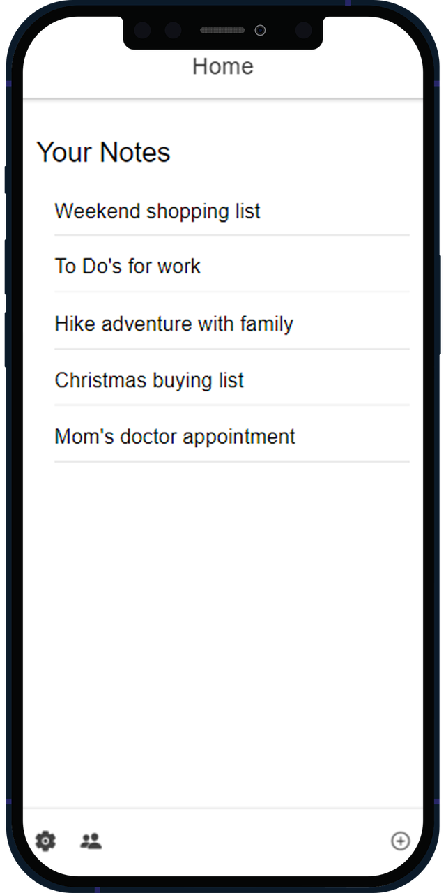
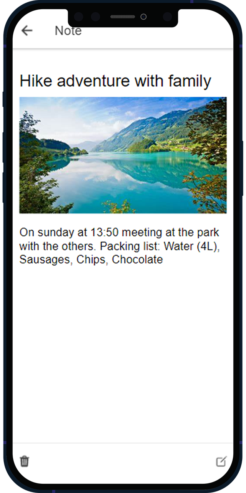

# 📝Neo Note - The Ultimate Notepad
Are you tired of forgetting important tasks and notes? Look no further, because Neo Note has got you covered! With our sleek and intuitive web-app, you can easily add, edit, and delete notes on the go. Whether you're at home or on the go, Neo Note has got your back. :)

## ⛲Features 
 🔒 Login and register to access your notes from any device <br>
 ✍️ Add, edit and delete notes with ease <br>
 🤝 Share your Notes with friends <br>
 📅 Add expiry- and reminder dates to your notes <br>
 🏪 Available on the internet, iOS and Google Play Store <br>
 <div>
  
 
  </div>
  
## 💁Information
 🔖 Made with Ionic --Angular Framework  ([Ionic](https://ionicframework.com) / [Angular](https://angular.io)) <br>
 💽 Uses Firebase as the Database  ([Firebase](httpsfirebase.google.com)) <br>
## 🧑‍💻Contributing
We welcome anyone to contribute to the Neo Note project! If you find any bugs or have suggestions for improvements, feel free to fork the repository and create a pull request with your changes.

### ✅ To Do's
- [ ] Refactor and clean up code
- [ ] Overall style-up of UI
- [ ] Expand login page / register page
- [ ] Add "infinite" height for textarea (new note)

- [ ] Publish app to App Store
- [ ] Publish app to Google Play Store

### 🤧Commands
There are a few commands that need to be run for the project to work on your computer!
* First of all you have to have **Node.js** installed to manage the packages run ```npm i``` ([Node.js](https://nodejs.org/en/))
* After installing you can **fork** and **clone** the repo to your computer and then open the project in **Visual Studio Code** ([VCS](https://code.visualstudio.com/download))
* Now install the **Ionic Extension** from VCS Extensions, it will offer you all needed libraries and packages to install ([VCS Ionic Docs](https://ionicframework.com/docs/intro/vscode-extension#:~:text=The%20Ionic%20Visual%20Studio%20Code%20extension%20helps%20you%20perform%20various,logo%20in%20the%20activity%20bar.))
* Now install the **Firebase Package** with ```ng add @angular/fire``` ([NPM Firebase](https://www.npmjs.com/package/firebase))
* **Run** the project on the browser with ```ionic serve```

### 📥Download
Head over to our GitHub repository to download the latest release of [Neo Note](https://github.com/Sigmale1000/neonote).

🚀 Start Taking Notes with Neo Note Today! [Neo Note web](https://neonote.sigmale.dev)

-------------------------------------------------
## 🦠Versions
¬ ***v1.0.0*** // Release of basic app and functions <br>
--¬ ***v1.0.1*** // Fixed display bug of new note page (text input) for web
